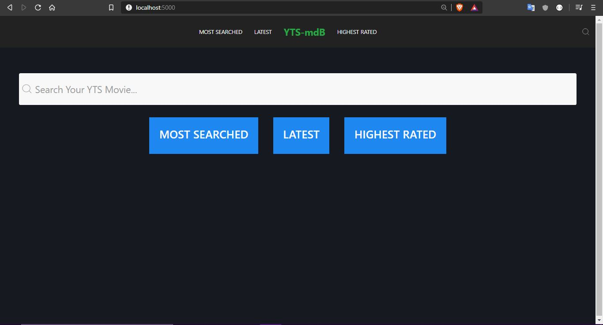
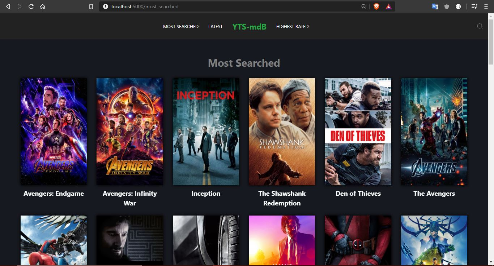
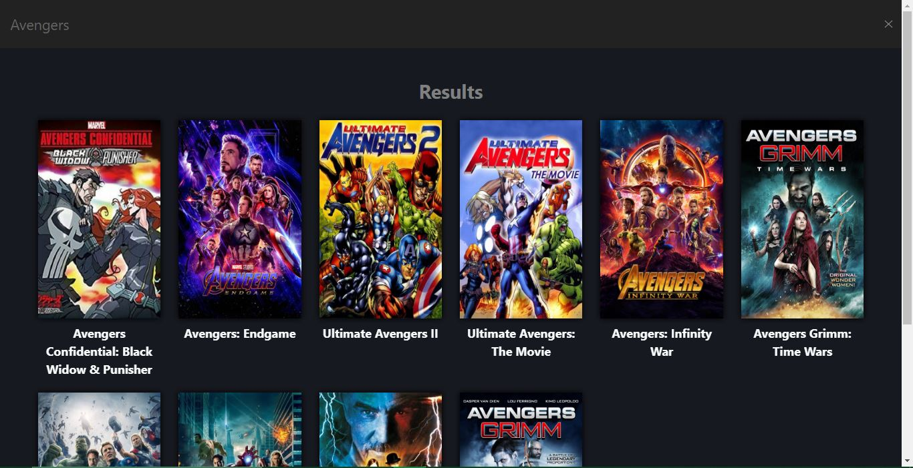
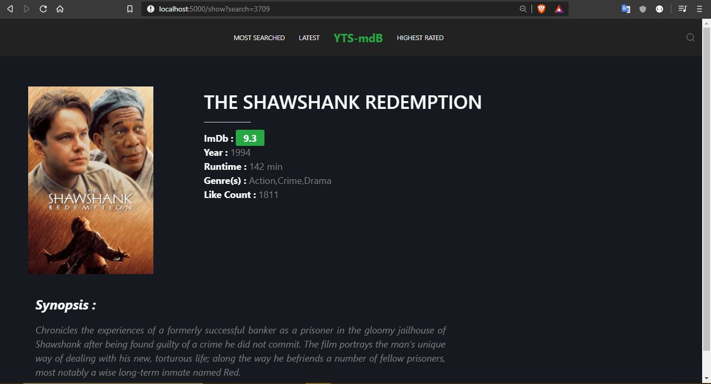

# movie-database-using-express

  A movie database system, using external api calls from YTS with unirest where you can search all the movies available in YTS movie database.
  

<h2>Resources</h2>
<ul>
  <li><a href="https://yts.mx/api">YTS APIs</a></li>
  <li><a href="https://getuikit.com/">UIkit (CSS Framework)</a></li>
</ul>

<h2>UI</h2>

